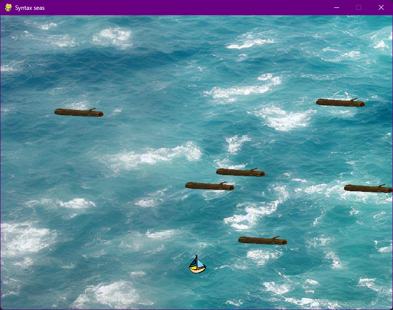

# Syntax Seas



Sail your way towards the world of coding. This interactive lesson teaches some of
the basics of programming in a fun and intuitive way.

# Getting Started

1. Install [Python](https://www.python.org/downloads/)
2. Clone this repository

```sh
git clone https://github.com/brandonp2412/SyntaxSeas
```

3. Install the dependencies

```sh
python3 -m pip install -U pygame --user
```

4. Start running lessons

```sh
cd SyntaxSeas
python types1.py
```
